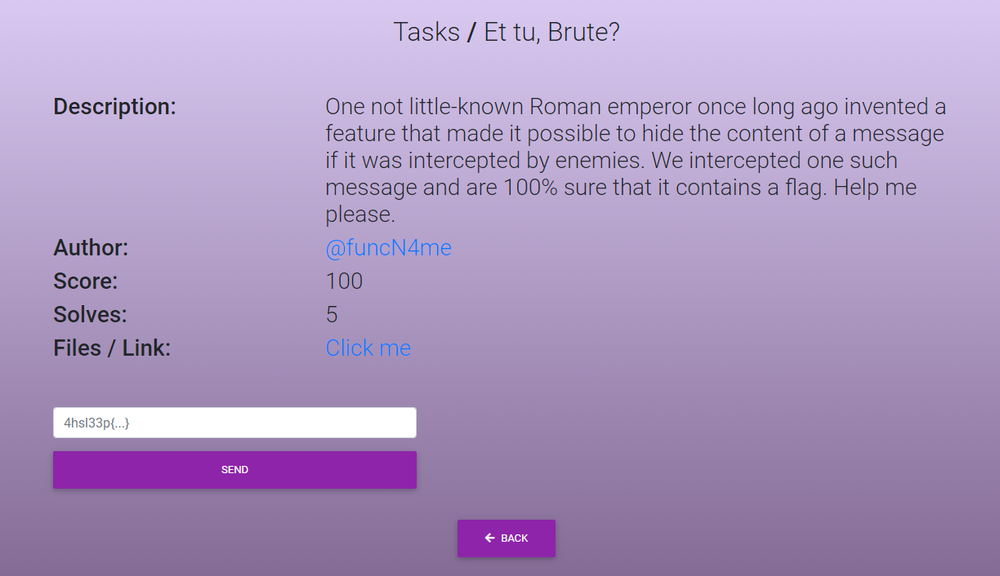
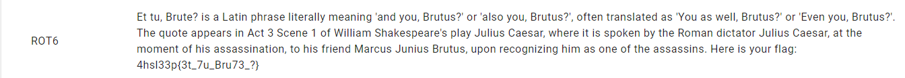

# Et tu, Brute?

Смотрим, что находится в файле: Yn no, Vlony? cm u Funch jblumy fcnyluffs gyuhcha 'uhx sio, Vlonom?' il 'ufmi sio, Vlonom?', iznyh nluhmfunyx um 'Sio um qyff, Vlonom?' il 'Ypyh sio, Vlonom?'. Nby koiny ujjyulm ch Uwn 3 Mwyhy 1 iz Qcffcug Mbueymjyuly'm jfus Dofcom Wuymul, qbyly cn cm mjieyh vs nby Liguh xcwnunil Dofcom Wuymul, un nby gigyhn iz bcm ummummchuncih, ni bcm zlcyhx Gulwom Dohcom Vlonom, ojih lywiahctcha bcg um ihy iz nby ummummchm. Byly cm siol zfua: 4bmf33j{3n_7o_Vlo73_?}

Описание к заданию в совокупности с названием даёт понять, что тот самый император – Цезарь. В голову приходит шифр Цезаря – классический метод шифрования. Находим первый же попавшийся сайт по запросу *шифр Цезаря расшифровать* или что-то подобное. Вставляем исходный текст, листаем до тех пор, пока не увидим что-то схожее с английскими словами.

Видим флаг: *4hsl33p{3t_7u_Bru73_?}*