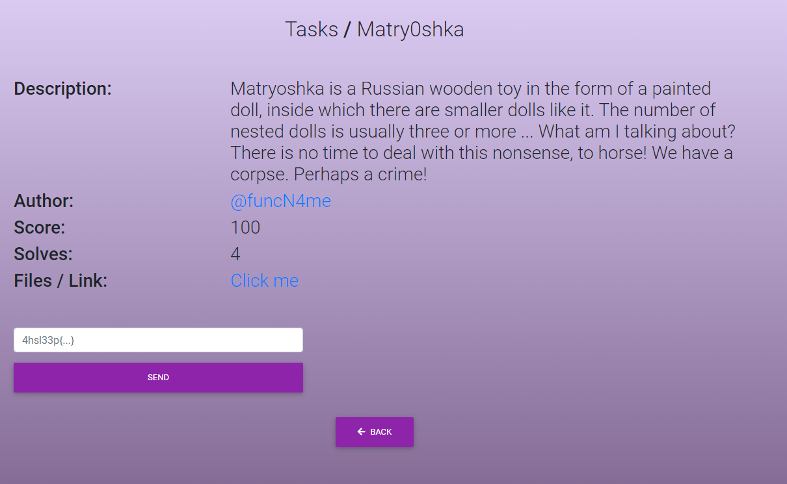

# Matry0shka

Текст в файле: 
>72 111 108 121 32 109 111 108 121 44 32 97 114 101 32 121 111 117 32 114 101 97 108 108 121 32 108 111 111 107 105 110 103 32 102 111 114 32 102 108 97 103 63 32 89 101 115 63 32 77 97 121 98 101 32 110 111 63 32 73 102 32 121 111 117 32 97 114 101 32 108 111 111 107 105 110 103 32 102 111 114 32 97 32 102 108 97 103 44 32 100 111 32 116 104 105 115 32 115 105 109 112 108 101 32 116 104 105 110 103 115 58 32 49 41 32 83 116 97 110 100 32 117 112 32 50 41 32 83 105 116 32 100 111 119 110 32 51 41 32 71 101 116 32 121 111 117 114 32 102 108 97 103 58 32 52 104 53 108 51 51 112 123 78 71 104 122 98 68 77 122 85 72 115 120 97 70 53 121 83 68 70 72 89 72 86 122 80 83 103 113 99 50 52 53 97 109 57 49 74 69 100 120 88 121 112 111 81 48 120 77 85 108 53 71 88 70 112 111 73 106 86 68 82 88 48 61 125

Описание в совокупности с названием в этот раз нам не даёт ничего, кроме того, что, возможно, там будут использоваться несколько кодировок.

Текст, лежащий в файле – десятичное представление **ASCII**-символов. 

Расшифруем с помощью CyberChef:
>Holy moly, are you really looking for flag? Yes? Maybe no? If you are looking for a flag, do this simple things: 1) Stand up 2) Sit down 3) Get your flag:4h5l33p{NGhzbDMzUHsxaF5ySDFHYHVzPSgqc245am91JEdxXypoQ0xMUl5GXFpoIjVDRX0=}

Несмотря на то, что в расшифровке написано “держите Ваш флаг” – это не флаг, так как он не совпадает с форматом флага. Символы внутри фигурных скобок – напоминают кодировку **base64**, так как используются все буквы латинского алфавита (и нижнего регистра и верхнего), а также наличие знака выравнивания (“**=**”) на конце строки.

Снова обращаемся к CyberChef:
>4hsl33P{1h^rH1G`us=(*sn9jou$Gq_*hCLLR^F\Zh"5CE}

Данная строка так же не является флагом. Строка внутри фигурных скобок – кодировка **base85**.

И снова CyberChef:
>*4hsl33p{Wa5_Ma7ry05hka_fuNny?}*

