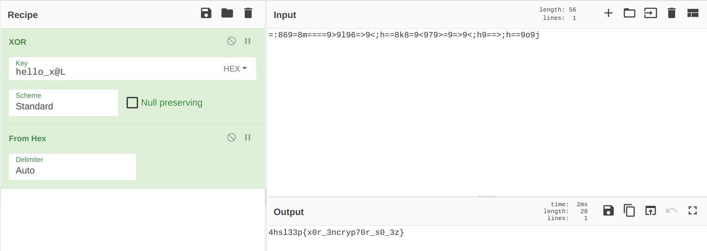

# XORochiy equation

Смотрим что нам дано:

    data = "=:869=8m====9>9l96=>9<;h==8k8=9<979>=9=>9<;h9==>;h==9o9j"

    hex(flag) ^ key = data
    use - https://gchq.github.io/CyberChef !
    Note: key in CyberChef is hex option!

Вспоминаем как работает **XOR**:

    data ^ key = hex(flag)

Дальше смотрим на ключ:

    key[i]:
        0. a = ? | 57 ^ a ^ 99 ^ 53; a > 0; a < 10
        1. b = a + 8 | 69 ^ b ^ 37 ^ 10
        2. c = a * b | 51 ^ c ^ 30 ^ 40
        3. d = с - 50 | 36 ^ d ^ 80 ^ 47
        4. e = 34 + a + b + d - c | 42 ^ e ^ 67
        5. 82 ^ key[0] ^ key[1]
        6. (((a ** e) ** (e ** a)) % 777) ^ 8
        7. 1392 ^ key[3] ^ key[1] ^ 1337
        8. 73 ^ key[7] ^ key[6] ^ key[5] ^ key[4] ^ key[3] ^ key[2] ^ key[1] ^ key[0]

Обычная зависимость переменных и известных по ходу решения данных ключа.

Начнём с **а**:

    a = ? | 57 ^ a ^ 99 ^ 53; a > 0; a < 10

    key[0] = 57 ^ a ^ 99 ^ 53, где a > 0; a < 10

Пишем скрипт перебора **а** и сразу смотрим, какой ключ у нас получается. *(Условие, что e > 1, приходит само, т.к иначе будет ошибка)*

    106 103 68 84 107 95 570 122 544 

    105 100 81 121 109 95 527 84 517 

    104 101 108 108 111 95 120 64 76 

    103 122 133 21 97 79 224 38 44 

    102 123 156 60 99 79 1 14 215

Это decimal в ASCII? - Да. Кастим в chr'ы.

    jgDTk_ȺzȠ

    idQym_ȏTȅ

    hello_x@L

    gz
    aOà&,

    f{œ<cO×

Видим единственный нормальный ключ - *hello_x@L*

Вспоминаем написанное в начале и идём на CyberChef:

Флаг - *4hsl33p{x0r_3ncryp70r_s0_3z}*