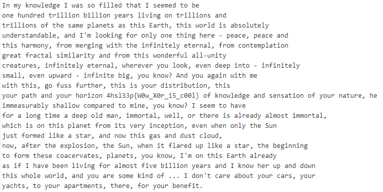

# XORoshiy MAN

### Текст в файле:

>ZY3ZjxY|@RwPvZdV``X3Qz[Rwg_rC3~3DvR~RwgX3Uv=|Yv{B}SaRwgEz[^|Y3Uz[^|Y3NvVaD3[zAzYt|Y3Ca^[zX}D3V}SCa^[zX}D3Xug_v`V~R3GV}RgD3V`g_zD3rrEg_?g_zD3@|ES3^`rU`XBgRNB}SvE`CrYwVq[v3V}S3~4Z3[|Xx^}P3Q|E3X}[j|Yvg_zYt{RaR33GvVpR?cRrTvrYw=g_zD3_rE~X}N?uE|Z3ZvEt^}P3@zC{g_vzYu^}^gRN3RgRaYr[?uE|Z3T|YgR~GVg^|YPaRrC3QaVpCr[3DzZz[rEzCjrYwuE|Z3C{^`dX}SvEuBr[fYzCj=pEvVgBaR`3^}QzYzCv[jvCvE}V3@{RaReRajXfX|\?vAvY3SvRczYgX33^}QzYzCv[j=`Zr[3ReR}fGdVaS33^}QzYzCvq^t3N|B3\}Xd3v}S3N|B3VtVzY3@zC{~R@zC{g_zD?tX3QfD`uBaC{Ra3C{^`zD3N|Baw^`Ca^qBg^|Y?g_zDN|BacVg_3V}S3N|Ba{Xa^iX}'_`[ cLDdhKahzLT#J3XuxY|@RwPvrYw`R}DrCzX}|Q3N|Ba}VgBaR?{R^~ZvV`BaVq[j`_r[XdpX~GrEvS3C|~^}R?jXfxY|@,Z`RvZ3C|{VeRQ|E3V3[|Ytg^~R3V3SvRc|[w~V}3^~Z|EgV3@v[3Xag_vEvzD3VEvVwN3VZ|DgzZ~XaCr[?=d_zT{zD3X}g_zD3GV}RguE|Z3^gD3AvEjzYpRcCzX}3ReR}d_vY3X}[jg_v@B}=yB`C3Q|E~Rw^xR3V3DgVa3V}S3Y|@3C{^`tV`rYwwB`C3TXfS?=}Xd3VuCvE3C{R3RkGX`^|Y?g_v@B}3@{R}zC3QVaRwfG3[z\vr`CrE?g_vqRt^}YzYt=gX3Q|E~g_vDvpXrTvEeVgR`3GV}RgD?jXfxY|@?Z~|Y3C{^`VVaC{r[aRrSj=rD3^uZ{VeR3UvR}^e^}P3Q|E3VZ|Dgu^eR3Uz[^|Y3NvVaD3V}S3~3\}Xd{RafG3V}S3S|@}=g_zD3@{XR3@|ES?rYwjXfrEv`X~R3\zYw|Q3=3~3S|Y4C3TrEvrU|BgjXfE3TrE`3N|Ba=jVp_gD?gX3N|BarGrEgZvYgD?g_vEv3Q|E3N|BaqR}Ru^g

Судя по описанию, исходный текст был зашифрован операцией **XOR** (сложение по модулю 2 (исключающее или)) с ключом **1337**. Исходя из познаний в области математической логики (булевой алгебры) мы знаем, что если **a ^ b = c**, то **c ^ b = a**. Нам ничего не остаётся, кроме того, что просто выполнить XOR шифротекста с известным нам ключом. Заходим на CyberChef, расшифровываем:

Флаг: *4hsl33p{W0w_X0r_i5_c00l}*
