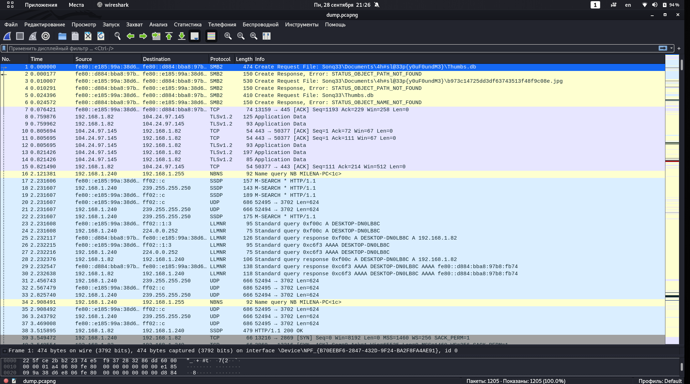
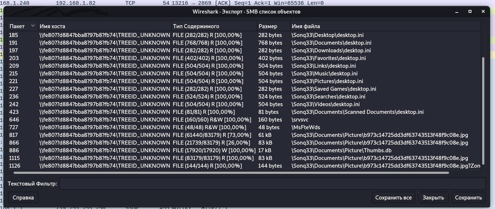

# Where is hinata?

Нам представлен захваченный трафик. Сразу видим протокол SMB - сетевой протокол для удаленного доступа к файлам и принтерам.

Переходим на вкладку ФАЙЛ>Экспортировать объекты>SMB..

Мы видим все файлы, к которым был получен удаленный доступ. 
Сохраняем все и просматриваем изображения. 
Находим Хинату!

Получили флаг: 4hsl33p{You_Found_M3}

