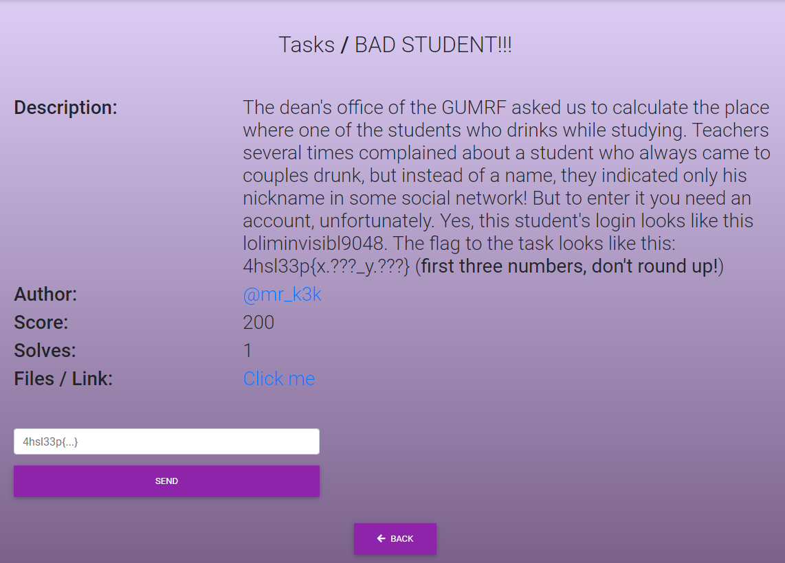
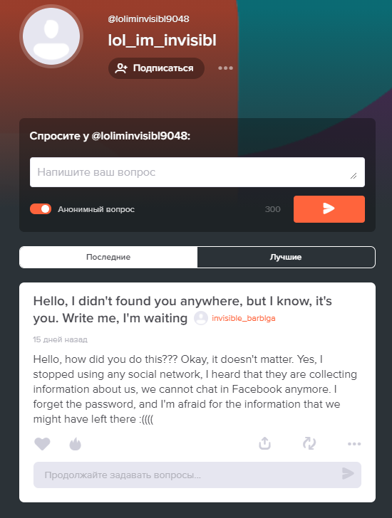
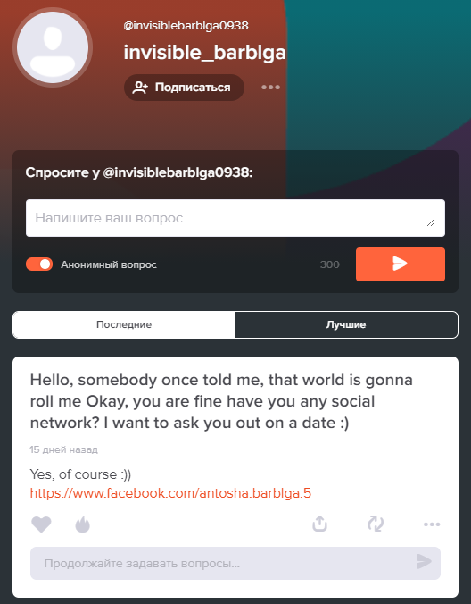
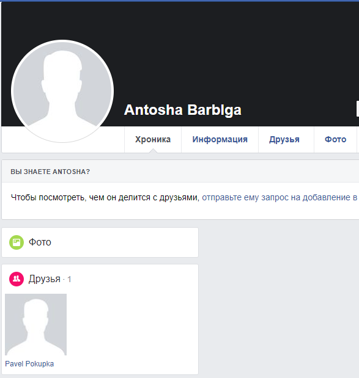
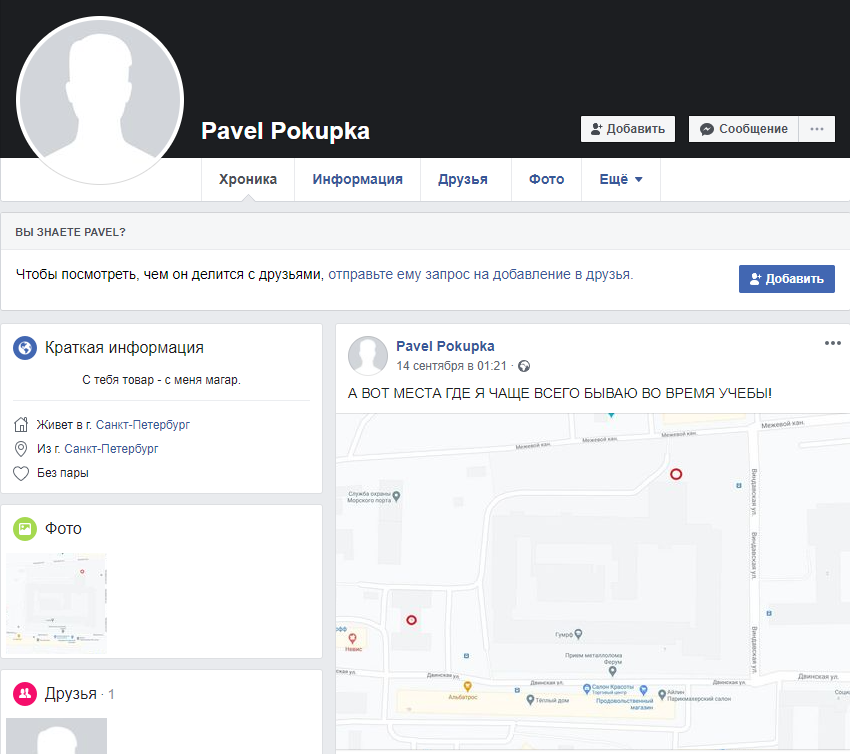
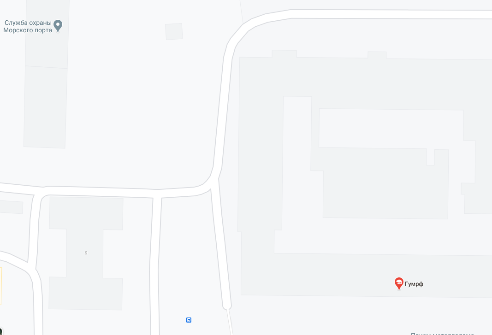
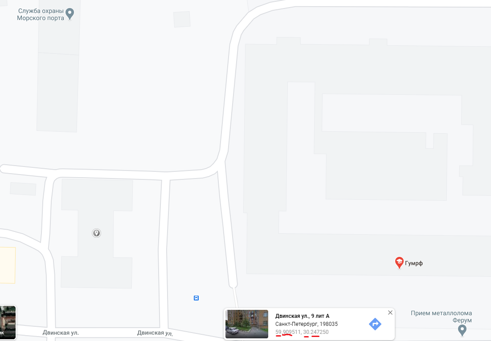

# BAD STUDENT!!!  

Глядя на формат флага и прочитав внимательно условие можно подумать, что ответом являются какие-то координаты.

Первым делом можем попробовать ввести данный нам ник (loliminvisibl9048) в поиск и ничего не получим. Дальше пробуем пробить через сайт https://namechk.com/, увидим, что он нашел этот ник в некоторых сервисах:

(Серым – где нашел). Если прокликаем по всем, то ничего не получим, но вот последняя – Ask.FM, переходим и видим такую картину:

Видим некую переписку между двумя пользователями, с ником loliminvisibl9048 и неким invisible\_barblga, кликаем по последнему:

В вопросах у барыги видим единственный вопрос, где у него спрашивают про соцсеть и он доблестно нам дает на нее ссылку, кликаем:

Попадаем на страницу барыги, а в друзьях у него всего один человек, кликаем на него:

И видим карту с двумя отмеченными точками, угадать координаты какой являются ответом, можно только проверкой. Правильной является левая точка, так что открываем ее на гугл картах или любых других и смотрим координаты:

Тыкаем в девяточку (номер дома на котором левая точка): 

Берем координаты с первыми тремя цифрами после точки и получаем флаг:

4hsl33p{59.909\_30.247}
