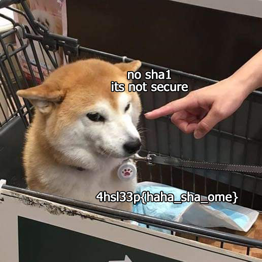

# Not secure

 > You can say whatever you wamt, but I love sha ome, the bemst algorithm! The guys said that everythimg is fime, the archive is premtty protected, but I will make it evem better! **18500** times better!
Take this: 872990182fa33d1da83a21c6e1a598dafee45776
 
Дан запароленный архив archive.rar и описание к таску, в котором есть строка **872990182fa33d1da83a21c6e1a598dafee45776** — очевидно, хэш.

[Hash-identifier](https://github.com/blackploit/hash-identifier) показывает, что, скорее всего, это **sha1**, о чем можно было догадаться из вида хэша или описания.

Попробовав пробить по обычному sha1 не получаем результата.

Попробуем посмотреть другие моды на hashcat, которые обвернуты в sha1.

Находим `18500 | sha1(md5(md5($pass))) | Raw Hash, Salted and/or Iterated`.

```
hashcat -m 18500 -a 0 '872990182fa33d1da83a21c6e1a598dafee45776' rockyou.txt
```
 
Хэш сломался и мы получаем пароль от архива.

```
872990182fa33d1da83a21c6e1a598dafee45776:sleepless1
```

Открываем архив и получаем картинку с флагом.



Флаг — *4hsl33p{haha_sha_ome}*