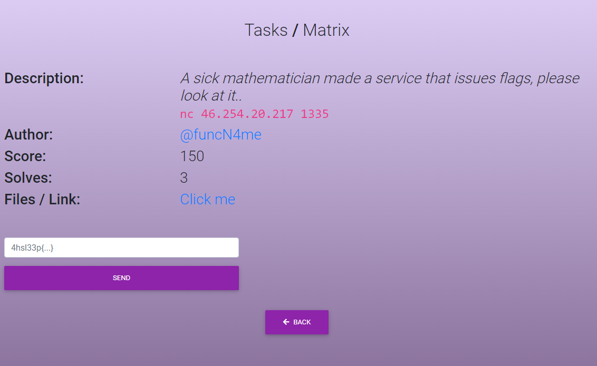

# Matrix



Подключаемся к указанному сервису, видим, что нам нужно найти 300 определителей матриц 2х2 (1 курс), по истечении 10 секунд сервис сбрасывает наше соединение. На выбор два варианта: 

1) Решать всё руками **(не надо)** 

2) Написать подобие данного скрипта **(надо)**

```python
from pwn import *
from time import sleep
conn = remote('46.254.20.217', 1336)

def solve(recieved, iter):
    iter += 1
    while iter <= 300:
        out = int(recieved[0]) * int(recieved[3]) - int(recieved[1]) * int(recieved[2])
        conn.sendline(str(out).encode())
        if iter == 300:
            print(conn.recvuntil("}").decode())
            sleep(0.5)
            exit(0)
        recieved = conn.recvuntil('>>>').decode()
        print(recieved)
        recieved = recieved[recieved.find("]") + 3: -5:].split()
        solve(recieved, iter)


recieved = conn.recvuntil('>>>').decode()
print(recieved)
recieved = recieved[recieved.find("]") + 3: -5:].split()
print(recieved)
iter = 0
print(solve(recieved, iter))
```
Подробнее о импортируемом модуле pwn следует почитать тут:  
>http://docs.pwntools.com/en/stable/ 

Запускаем скрипт, получаем флаг: *4hsl33p{M4tr1c3s_5uch_ma7r1c3s}*
