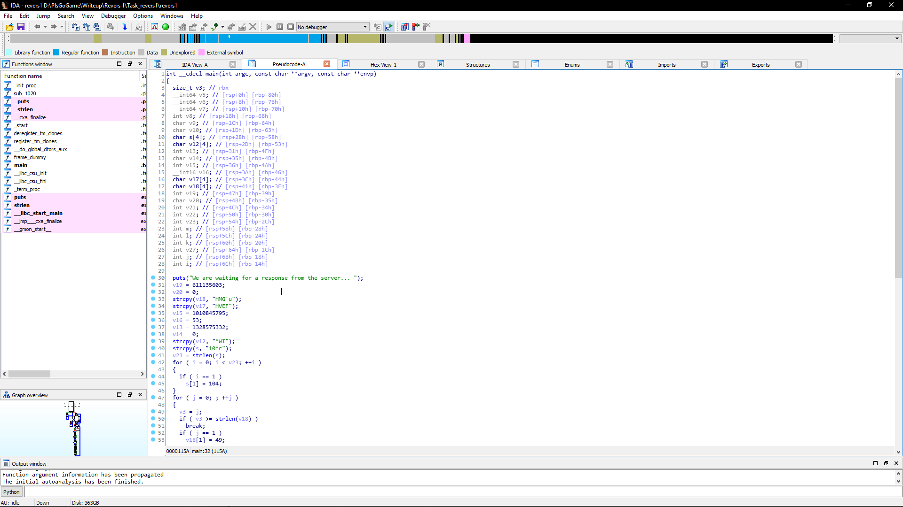
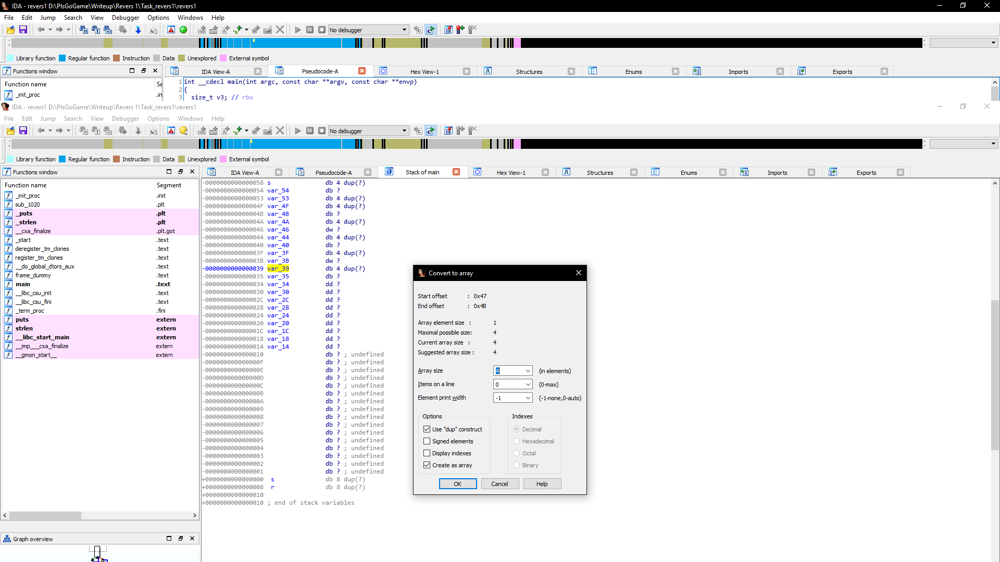
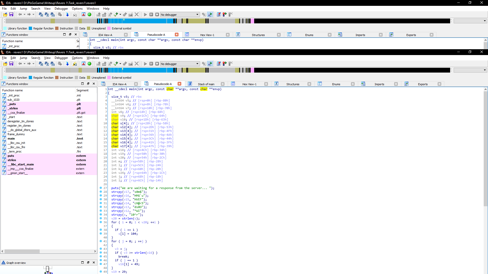
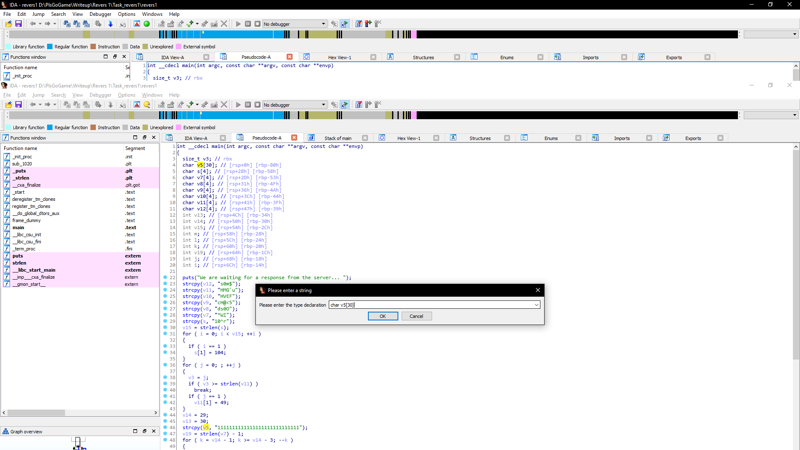

# S3cr3t Cat Club

У нас есть исполняемый файл linux. Отправляем его в IdaPro.

Видим много переменных. Кликаем правой кнопкой мыши, меняем представление на char.
Типы переменных не соответствуют их значениям. Значит меняем их на массивы char.

Кликаем на переменную дважды. Попадаем в стек. Правой кнопкой на переменную, выбираем Arrays. 

Возвращаемся в псевдокод и нажимаем F5.

Ниже в переменной v5 видим массив сломанный массив из 30 единиц. Кликаем на перменную и нажимаем Y. Меняем тип данных на char v4[30].

Теперь мы получили читаемый код. Анализируем и собираем строку со всеми заменами и перестановками. 

Получаем строку: 1h^rH1G`us0m$cH@<5ds0OHVEF*W0 

Юзаем CyberChef + Base85 

Получаем флаг: 4hsl33p{1t_was_s0_3asy}