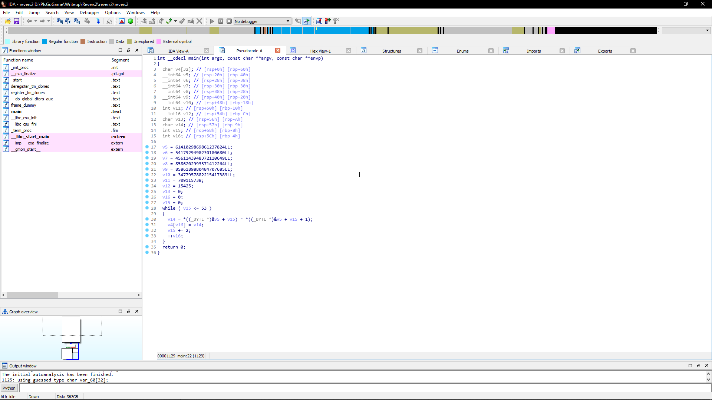
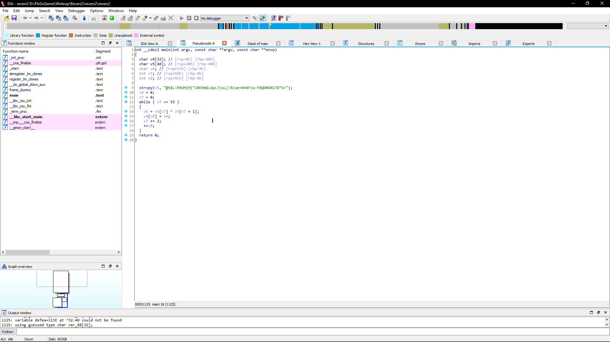

# S3cr3t Myau

У нас есть исполняемый linux-файл. Отправляем его в декомпилер. 

Получаем набор переменных. Меняем представление на чар (правой кнопкой мыши на переменную и выбираем char). 

Видим в коде ксор. Скорее всего это массив char. Проверили длинну. Собрали массив (Кликаем на v5 и нажимаем Y. меняем int v5 на char v5[48]) 

Получили читаемый код. 

Видим, что каждый i-ый элемент ксорится с каждым i+1 элементом.

Исполнили. 

Получили флаг: 4hsl33p{Th1s_1s_X0r_kitten}