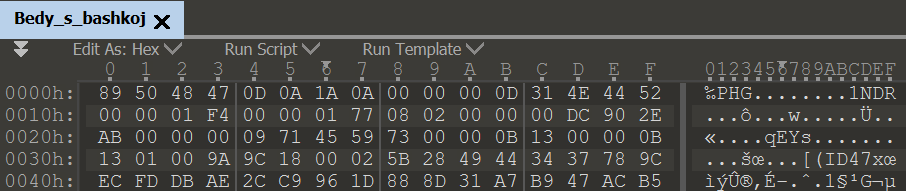
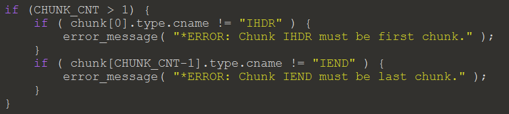
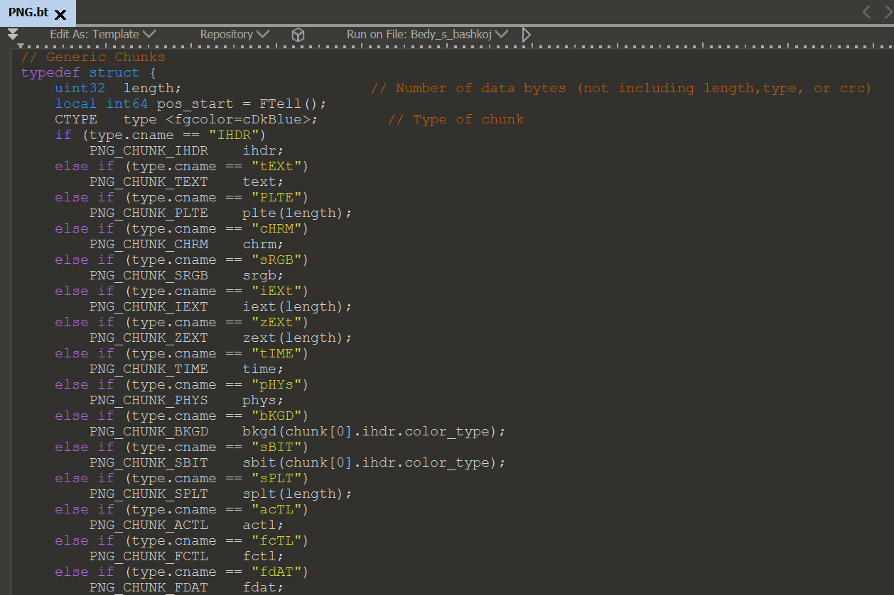
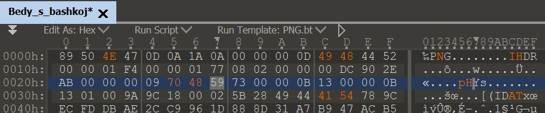
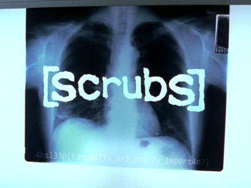

# Bedy s bashkoj (head)

> Note: it is STRONGLY recommended to use 010 editor and its 'features'. Now it's also a small Reversee task, if you find *.bt

Дан файл без расширения, открываем его через хекс-редактор, видим странные сигнатуры, которые не подходят ни к какому формату.

Проверяем конец файла, находим там `54 72 79 20 75 73 69 6e 67 20 74 65 6d 70 6c 61 74 65 73`, декодируем хексы и получаем:

> Try using templates

Особенность 010 editor — возможность использования шаблонов, об этом и говорилось в описании к таску.

По сигнатурам окончания ``IEND®B`‚ (49 45 4E 44 AE 42 60 82)`` понимаем, что это должен быть png файл.

Разбираем код темплейта (файл, с расширением **bt**), и находим там вполне однозначные условия.

Восстанавливаем хидер файла согласно коду.

Сохраняем файл с расширением **png**, получаем флаг.

Флаг — *4hsl33p{t3mpl473s_ar3_pre77y_1mp0rt4n7}*
