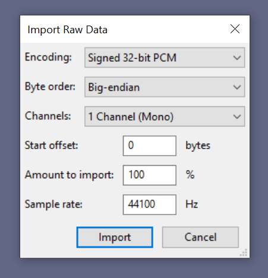

# Endians

 > Employees of the secret laboratory are sure that something is hidden in the audio file, but for some reason the studies were closed, all the ~~test-subjects~~ specialists had already given up, suffering from a terrible headache. As it turned out, the cost of a mistake is life (ability to hear). However, an annex to the file was recently discovered, perhaps at least it will bring some clarity. Note: Adjust the flag to match the usual 4hsl33p{...}

Дан аудио-файл формата wav и изображение, в котором, согласно описанию, должна быть подсказка.

Открываем аудио-файл, и быстро его закрываем, так как там кошмарный шум.

Гуглим, что такое endians, и находим, что это **порядок байтов**, есть как big-endian, так и little-endian, что полностью соответствует подсказке в таске.

Для преобразования файла будем импортировать его как **raw-файл** *(сырые данные)* через [Audacity](https://github.com/audacity/audacity)

Программа сразу нам предлагает ипортировать данные в big-endian

Получаем хоть и немного шумную, но вполне разборчивую композицию.

Поверх основной композиции наложен флаг ~~и пасхалка~~ несколько раз, выбираем ту, что в конце файла, так как там меньше всего посторонних шумов. Немного настраиваем скорость и тональность — получаем флаг.

Флаг — *4hsl33p{little_but_not_least}*