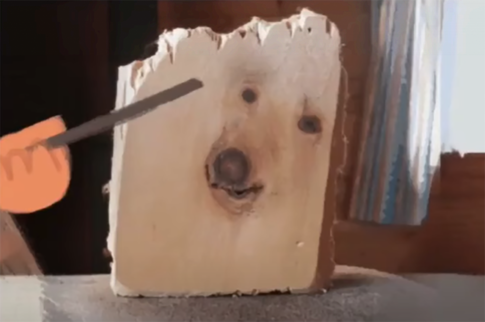
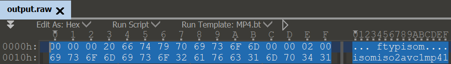

# Least Significant Bonk



> It looks like you need to use the tool — stego(Least_Significant_Bonk) #Change the name of the tool, think a little about task name

Дана картинка **Least_Significant_Bonk.png**, описание явно указывает на использование тулзы. По первым буквам названия таска собираем **lsb** — [StegoLSB](https://github.com/ragibson/Steganography)

```
stegolsb steglsb -r -i Least_Significant_Bonk.png -o output.raw
```

Достали файлик и смотрим его через хекс-редактор, по сигнатурам гуглим, что это должен быть за формат — получаем mp4.



Смотрим видео — находим флаг


Флаг -- *4hsl33p{m0_wav_anym0re}*