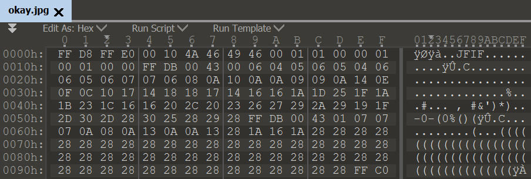
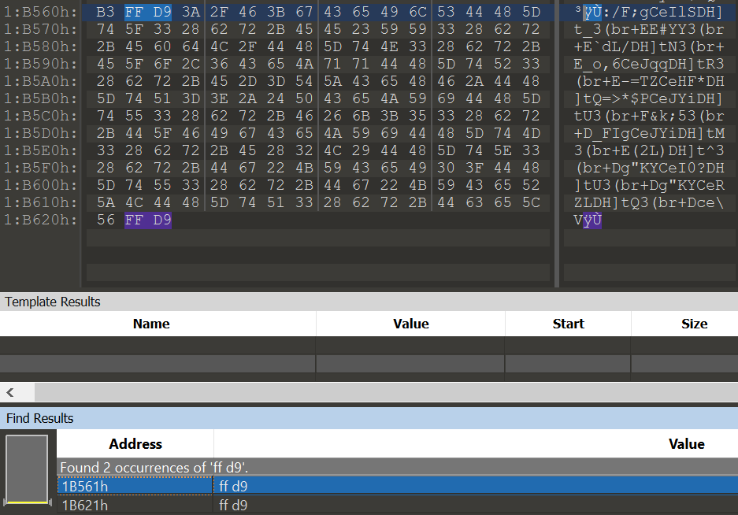
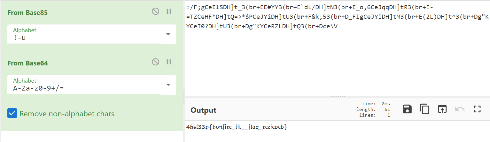

# Okay?

 > “Everything will be okay in the end. If it's not okay, it's **not the end**.”
 Note: Adjust the flag to match the usual 4hsl33p{...}

Открываем файл в хекс-редакторе, видим обычные сигнатуры jpeg файла `ÿØÿà..JFIF (FF D8 FF EO)` и т.д.

У многих форматов файлов есть фиксированные сигнатуры, отвечающие за начало и конец файла/определенного чанка. У png за конец файла отвечают байты ``IEND®B`‚ (49 45 4E 44 AE 42 60 82)``, а у jpeg `ÿÙ (FF D9)`.

Особенность в том, что поосле этих байт можно написать все что угодно, и это не будет влиять на структуру файла, так как они просто считываться не будут.

Смотрим наш файл и ищем сигнатуру окончания. Результат поиска показывает, что сочетание этих байт найдено дважды.

Декодируем информацию, между этих байтов через [CyberChef](https://gchq.github.io/CyberChef/).

*base85 — base64 — флаг* 

Флаг — *4hsl33p{bonfire_lit__flag_recieved}*