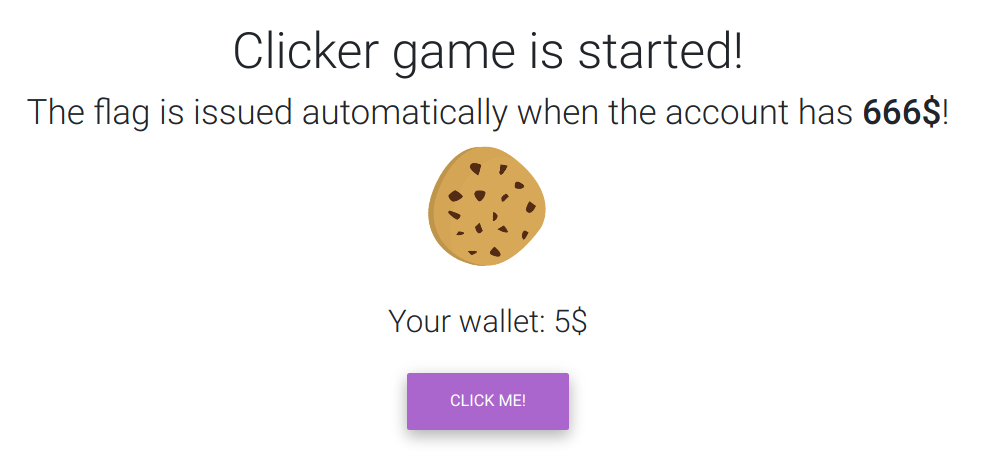

# Clicker



Смотрим на <s>крутящуюся печеньку и меняющийся цвет кнопочки</s> таск, нужно **666$**...

Кликаем, чтобы получить тело запроса.

Видим, что идёт **POST** запрос на **/add** и отправляется **{"money":"add"}**.

Берём куки, пишем скрипт на питоне.

```python
import requests as r

head = {
    "Content-Type": "application/json",
    "Cookie": "session=e17950b9-e58e-4844-a6de-30673fada36a"
}

data = {
    "money" : "add"
}

while True:
    res = r.post('http://46.254.20.217:2002/add', headers = head, data = data).text
    print("Result: ",res)
    if "4hsl33p" in res:
        break
```

Запускаем

```sh
$ python3 solve.py
Result:  {"money":3,"success":true}
Result:  {"money":4,"success":true}
Result:  {"money":5,"success":true}
Result:  {"money":6,"success":true}
Result:  {"money":7,"success":true}
...
Result:  {"money":664,"success":true}
Result:  {"money":665,"success":true}
Result:  {"flag":"4hsl33p{U_4R3_CL1CK3D??}","success":true}
```

Флаг - *4hsl33p{U_4R3_CL1CK3D??}*

<s>Кстати, можно было и накликать.. и в теле 666 ответа будет флаг. Но кому это надо?</s>